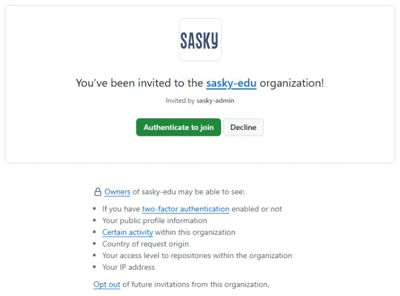

# SASKY EDU -organisaatioon liittyminen

Voit liittyä SASKY EDU -organisaatioon, jos olet SASKY koulutuskuntayhtymän tieto- ja viesintätekniikan opiskelija tai opettaja.

Liittyminen tapahtuu hyväksymällä oppilaitoksen sähköpostiin tullut liittymiskutsu. Jotta voit liittyä mukaan, sinulla tulee olla oma GitHub-käyttäjätili luotuna itsellesi. Jos sinulla ei ole vielä omaa tiliä GitHubissa, niin voit itsellesi ilmaisen tilin alla olevilla ohjeilla. 

Jos sinulla on jo oma GitHub-tili, niin silloin voit hypätä suoraan kohtaan [Organisaatioon liittyminen](#organisaatioon-liittyminen).

## GitHub-tilin luominen

Seuraavilla ohjeilla luot itsellesi uuden tilin GitHub-palveluun.

1. Avaa uuden GitHub-tilin rekisteröintilomake osoitteesta [https://github.com/signup](https://github.com/signup).

2. Syötä lomakkeelle tietosi. 
    - Syötä **Email**-kenttään sähköpostiosoite, jota käytät aktiivisesti.
    - Syötä **Password**-kenttään turvallinen ja muistettava salasana, jota et käytä muualla.
    - Syötä **Username**-kenttään käyttäjänimesi. Käyttäjänimi näkyy kaikille muille GitHubin käyttäjille, joten valitse se viisaasti.
    - **Your Country/Region** -kohtaan valitse maaksi **Finland**.

    > GitHubiin kannattaa luoda oma tili, vaikka GitHub tukeekin Google- ja Apple-tunnusten kautta kirjautumista. Komentoriviltä tapahtuvat kirjautumiset ovat yksinkertaisempia oman GitHub-tilin kautta.

   Kun olet syöttänyt edellä olevat tiedot, niin luo uusi tili klikkaamalla **Create account >** -nappia.

3. Edellisessä vaiheessa syöttämääsi sähköpostiosoitteeseen lähetetään kahdeksan numeroinen vahvistuskoodi, syötä se avautuvalle lomakkeelle.

4. Jos tilin vahvistaminen onnistui, niin päädyt kirjautumissivulle, jonka yläosassa lukee vihreällä taustalla teksti `Your account was created succesfully! Please sign in to continue`.

   GitHub-tilisi on nyt luotu ja voit kirjautua sisälle käyttäjätunnuksella ja salasanalla, jotka määrittelit aiemmin.

## Organisaatioon liittyminen

Seuraavilla ohjeilla liityt GitHub-tililläsi SASKY EDU -organisaatioon.

1. Mene GitHubin kirjautumissivulle osoitteessa [https://github.com/login](https://github.com/login) ja kirjaudu sisään. Jos olet jo kirjautunut sisälle, niin varmista että olet kirjautunut niillä GitHub-tunnuksilla, joilla haluat liittyä organisaatioon.

2. Avaa oppilaitoksen sähköpostista viesti, jossa sinut kutsutaan liittymään organisaatioon. Klikkaa viestissä olevaa **Join @sasky-edu** -nappia.

   

     
   

   > Kutsu on voimassa ainoastaan 7 päivää. Jos kutsu on vanhentunut, niin voit pyytää uutta kutsua seuraavilta henkilöiltä:
   >  - Pekka Aalto

3. Hyväksy kutsu klikkaamalla **Authenticate to join** -nappia. 

   

     
   

   > Jos et ole kirjautunut sisälle oppilaitoksen M365-tunnuksilla, niin tässä vaiheessa sinua pyydetään kirjautumaan niillä sisälle.

4. Kutsun hyväksymisen jälkeen sinut on liitetty osaksi SASKY EDU -organisaatiota. Tämän jälkeen voit käyttää organisaatiota opiskeluissasi.

   Organisaation etusivulta [https://github.com/sasky-edu](https://github.com/sasky-edu) löytyy ohjeita GitHubin käyttöön. Ne kannattaa käydä lukaisemassa. Ohjeet näkyvät, kun olet kirjautunut organisaatioon tunnuksillasi.

   Koska organisaation käyttöoikeus varmistetaan M365-tunnusten perusteella, niin jatkossa sinulta kysytään sekä GitHub-tunnukset että oppilaitoksen M365-tunnukset käyttäessäsi `sasky-edu`-organisaatiota. 